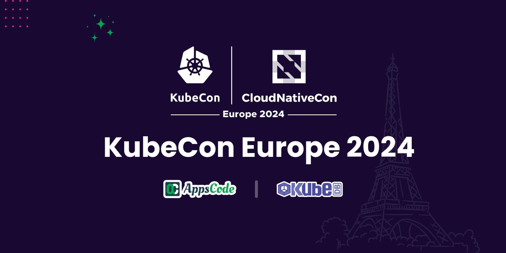

## Overview
In the fast-paced world of Kubernetes and cloud-native technologies, KubeCon has emerged as the premier event where industry leaders, developers, and enthusiasts explore the latest innovations and trends. This year, KubeCon Europe was the biggest KubeCon till date with over 12,000 attendees and found its stage in the enchanting city of Paris. 
We, Team AppsCode joined KubeCon as one of the event sponsors and we have a story to tell you. 
Here we go.

## Preparation
The excitement was there as Team AppsCode was prepping for KubeCon Europe 2024. From crafting an eye-catching booth design to securing the coolest swag, and most importantly, announcing KubeDB v2024.3.16 with the latest features! , the team did it all. 

Our mission was twofold. We wanted to hear firsthand how developers manage databases within Kubernetes environments, and in turn, demonstrate how KubeDB can streamline that process. But KubeCon isn't just about us – it's about the power of the community. We were also eager to soak up the knowledge shared in the insightful talks and sessions.

## The environment
Imagine a vibrant space packed with passionate developers, industry leaders, and tech enthusiasts, all united by their love for Kubernetes and cloud-native technologies. That’s what KubeCon Paris was. 

Booths were like mini showcases of all the cool stuff happening in the Kubernetes world. There were demos you could try, talks to listen to, and friendly folks everywhere to answer your questions.
KubeCon was all about making connections and getting inspired by the energy in the room!

## Our Booth and Showcasing KubeDB
The booth of AppsCode was a well-packed one and we had visitors all the time. 
Lots of developers stopped by to chat, and they all seemed to have one thing in mind: they were eager to find ways to streamline database management within their Kubernetes environments.
For example, one developer we met was tired of having to manually set up and grow his databases all the time. We showed him how KubeDB can do that automatically, saving him a ton of time and effort.

Another group of visitors expressed interest in leveraging KubeDB's high availability features to ensure their application's database remained accessible in the event of an outage. We showed them  KubeDB's disaster recovery capabilities, giving them peace of mind.

KubeCon was all about the conversations! It was amazing to see everyone's excitement for Kubernetes and managned databases. 

## KubeDB at KubeCon Paris - Top 5 Features and a Winning UI:

Throughout the event, we showcased KubeDB to visitors who are eager to streamline their Kubernetes databases. Here are the Top 5 features that resonated most deeply:

- Effortlessly automate provisioning, scaling, and backups, freeing developers for innovation.
- Automatic failover and disaster recovery with backups ensuring zero downtime
- Define custom resources to perfectly tailor KubeDB to your specific database needs.
- Keep a watchful eye on database health with integrated monitoring dashboards.
- Deploy KubeDB across various cloud providers for ultimate flexibility and to avoid vendor lock-in.

We showcased our intuitive UI at KubeCon, and developers were impressed by its ability to simplify database management within Kubernetes. This user-friendly interface offered a clear overview of database health, deployments, and resources, allowing for quick troubleshooting and informed decisions.

## The Road Ahead: 
The momentum from KubeCon keeps building. We're continuously pushing the boundaries with advancements like offering a wider range of databases, enhanced security features, increasing maturity in multi-cloud support, improving the user experience for managing databases in Kubernetes with our advanced UI.

## Conclusion: 
So here we end our story. 
Both KubeCon and Paris were amazing! The biggest KubeCon gave Team AppsCode the biggest response. The whole event was inspiring, and it makes us even more excited to keep improving KubeDB so it's the best tool ever for Kubernetes databases. Thank you to everyone who stopped by our booth at KubeCon Paris! 

If you want to try out KubeDB visit: https://kubedb.com

